# Parking Lot Management System

## Table of Contents
1. [Overview](#overview)
2. [Features](#features)
3. [Architecture](#architecture)
4. [UML Diagrams](#uml-diagrams)
5. [File Structure](#file-structure)
6. [Business Rules](#business-rules)

## Overview

The Parking Lot Management System is a comprehensive Java application designed to manage multi-floor parking facilities with support for various vehicle types, electric vehicle charging, flexible pricing strategies, and multiple payment methods. The system is built following Object-Oriented Programming principles, SOLID design principles, and implements multiple design patterns for maximum flexibility and maintainability.

### Key Objectives
- Efficient space utilization across multiple floors
- Support for diverse vehicle types including electric vehicles
- Flexible pricing and slot allocation strategies
- Comprehensive payment processing system
- Extensible architecture for future enhancements
- Type-safe operations with proper error handling

## Features

### Core Functionality
- **Automated Ticket Generation**: Unique ticket IDs with timestamp tracking
- **Multi-Payment Support**: Cash, Card, and Digital payment methods
- **Capacity Management**: Automatic entry denial when parking lot reaches capacity
- **Vehicle Type Support**: Cars, Motorcycles, Trucks, Electric Cars, Electric Motorcycles
- **Electric Vehicle Infrastructure**: Dedicated charging stations with usage-based billing
- **Flexible Slot Assignment**: Smaller vehicles can utilize larger slots with appropriate pricing
- **Multi-Floor Operations**: Comprehensive support for parking across multiple building floors
- **Intelligent Slot Allocation**: Configurable strategies for optimal space utilization

### Advanced Features
- **Strategy Pattern Implementation**: Pluggable algorithms for slot allocation and pricing
- **Real-time Availability Tracking**: Live monitoring of slot occupancy and availability
- **Charging Station Management**: Automatic assignment and billing for electric vehicle charging
- **Dynamic Pricing Models**: Support for hourly, flat-rate, and custom pricing strategies
- **Comprehensive Logging**: Detailed transaction and operation logging
- **Error Handling**: Robust error management with appropriate exception handling

## Architecture

### System Architecture Overview
The system follows a layered architecture pattern with clear separation of concerns:

1. **Presentation Layer**: Demo classes and main application entry points
2. **Business Logic Layer**: Core parking lot operations and strategy implementations
3. **Data Access Layer**: Model classes representing system entities
4. **Service Layer**: Strategy interfaces and payment processing
5. **Utility Layer**: Enumerations and constants

### Component Interaction
- **ParkingLot**: Central orchestrator managing all parking operations
- **Strategy Components**: Pluggable algorithms for allocation and pricing
- **Payment System**: Abstracted payment processing with multiple implementations
- **Vehicle Hierarchy**: Polymorphic vehicle types with specialized behaviors
- **Slot Management**: Individual parking space management with charging capabilities


## UML Diagrams

### Class Diagram

```mermaid
classDiagram
    class ParkingLot {
        -String name
        -List~ParkingSlot~ slots
        -Map~String,Ticket~ activeTickets
        -SlotAllocationStrategy allocationStrategy
        -PricingStrategy pricingStrategy
        +ParkingLot(String, SlotAllocationStrategy, PricingStrategy)
        +parkVehicle(Vehicle) Ticket
        +exitVehicle(String, PaymentMethod) double
        +displayAvailability() void
        +setAllocationStrategy(SlotAllocationStrategy) void
        +setPricingStrategy(PricingStrategy) void
    }

    class Vehicle {
        <<abstract>>
        -String licensePlate
        -VehicleType type
        +getLicensePlate() String
        +getType() VehicleType
        +isElectric() boolean
    }

    class Car {
        +Car(String licensePlate)
    }

    class Motorcycle {
        +Motorcycle(String licensePlate)
    }

    class Truck {
        +Truck(String licensePlate)
    }

    class ElectricCar {
        -boolean usingCharging
        +ElectricCar(String licensePlate)
        +isUsingCharging() boolean
        +setUsingCharging(boolean) void
    }

    class ElectricMotorcycle {
        -boolean usingCharging
        +ElectricMotorcycle(String licensePlate)
        +isUsingCharging() boolean
        +setUsingCharging(boolean) void
    }

    class ParkingSlot {
        -String slotId
        -SlotType type
        -int floor
        -boolean hasChargingStation
        -Vehicle parkedVehicle
        -boolean isOccupied
        +canFit(Vehicle) boolean
        +parkVehicle(Vehicle) void
        +removeVehicle() Vehicle
    }

    class Ticket {
        -String ticketId
        -String vehicleLicense
        -String slotId
        -LocalDateTime entryTime
        -LocalDateTime exitTime
        -double amount
        -boolean isPaid
    }

    class SlotAllocationStrategy {
        <<interface>>
        +findSlot(List~ParkingSlot~, Vehicle) ParkingSlot
    }

    class NearestSlotStrategy {
        +findSlot(List~ParkingSlot~, Vehicle) ParkingSlot
    }

    class RandomSlotStrategy {
        +findSlot(List~ParkingSlot~, Vehicle) ParkingSlot
    }

    class PricingStrategy {
        <<interface>>
        +calculatePrice(Ticket, ParkingSlot, Vehicle) double
    }

    class HourlyPricingStrategy {
        -Map~SlotType,Double~ hourlyRates
        -double chargingRate
        +calculatePrice(Ticket, ParkingSlot, Vehicle) double
    }

    class FlatPricingStrategy {
        -Map~SlotType,Double~ flatRates
        -double chargingRate
        +calculatePrice(Ticket, ParkingSlot, Vehicle) double
    }

    class PaymentMethod {
        <<interface>>
        +processPayment(double) boolean
        +getPaymentType() String
    }

    class CashPayment {
        +processPayment(double) boolean
        +getPaymentType() String
    }

    class CardPayment {
        -String cardNumber
        +processPayment(double) boolean
        +getPaymentType() String
    }

    class DigitalPayment {
        -String walletType
        +processPayment(double) boolean
        +getPaymentType() String
    }

    class VehicleType {
        <<enumeration>>
        MOTORCYCLE
        CAR
        TRUCK
        ELECTRIC_CAR
        ELECTRIC_MOTORCYCLE
    }

    class SlotType {
        <<enumeration>>
        MOTORCYCLE
        CAR
        TRUCK
        +canFit(VehicleType) boolean
        +getRequiredSlotType(VehicleType) SlotType
    }

    Vehicle <|-- Car
    Vehicle <|-- Motorcycle
    Vehicle <|-- Truck
    Vehicle <|-- ElectricCar
    Vehicle <|-- ElectricMotorcycle
    
    SlotAllocationStrategy <|.. NearestSlotStrategy
    SlotAllocationStrategy <|.. RandomSlotStrategy
    
    PricingStrategy <|.. HourlyPricingStrategy
    PricingStrategy <|.. FlatPricingStrategy
    
    PaymentMethod <|.. CashPayment
    PaymentMethod <|.. CardPayment
    PaymentMethod <|.. DigitalPayment
    
    ParkingLot --> SlotAllocationStrategy
    ParkingLot --> PricingStrategy
    ParkingLot --> ParkingSlot
    ParkingLot --> Ticket
    ParkingSlot --> Vehicle
    Vehicle --> VehicleType
    ParkingSlot --> SlotType
```



## File Structure

```
src/
└── com/
    └── example/
            ├── Main.java                           # Application entry point
            ├── enums/
            │   ├── VehicleType.java               # Vehicle type enumeration
            │   └── SlotType.java                  # Slot type with business logic
            ├── models/
            │   ├── vehicle/
            │   │   ├── Vehicle.java               # Abstract base vehicle class
            │   │   ├── Car.java                   # Standard car implementation
            │   │   ├── Motorcycle.java           # Motorcycle implementation
            │   │   ├── Truck.java                 # Truck implementation
            │   │   ├── ElectricCar.java          # Electric car with charging capability
            │   │   └── ElectricMotorcycle.java    # Electric motorcycle implementation
            │   ├── ParkingSlot.java              # Individual parking slot management
            │   └── Ticket.java                    # Parking session ticket
            ├── strategy/
            │   ├── allocation/
            │   │   ├── SlotAllocationStrategy.java # Slot allocation strategy interface
            │   │   ├── NearestSlotStrategy.java   # Nearest available slot strategy
            │   │   └── RandomSlotStrategy.java    # Random slot selection strategy
            │   └── pricing/
            │       ├── PricingStrategy.java       # Pricing calculation strategy interface
            │       ├── HourlyPricingStrategy.java # Time-based hourly pricing
            │       └── FlatPricingStrategy.java   # Fixed flat rate pricing
            ├── payment/
            │   ├── PaymentMethod.java             # Payment processing interface
            │   ├── CashPayment.java              # Cash payment implementation
            │   ├── CardPayment.java              # Credit/debit card payment
            │   └── DigitalPayment.java           # Digital wallet payment
            ├── core/
            │   └── ParkingLot.java               # Main system orchestrator
            └── demo/
                └── ParkingLotDemo.java           # Comprehensive demonstration scenarios

```

## Business Rules

### Slot Assignment Rules
1. **Size Compatibility**: Smaller vehicles can use larger slots
2. **Electric Vehicle Priority**: Electric vehicles automatically assigned to charging slots when available
3. **Pricing Based on Slot**: Payment calculated based on slot type, not vehicle type
4. **Floor Preference**: Lower floors preferred unless strategy specifies otherwise

### Pricing Rules
1. **Minimum Billing**: One-hour minimum for hourly pricing strategies
2. **Charging Costs**: Applied only when electric vehicle actually uses charging station
3. **Slot Type Pricing**: Cost determined by slot size, allowing revenue optimization
4. **Strategy Flexibility**: Pricing can be changed dynamically without system restart

### Payment Processing
1. **Payment Required**: Exit only allowed after successful payment processing
2. **Failed Payment Handling**: Vehicle remains parked if payment fails
3. **Multiple Payment Methods**: Support for various payment types
4. **Transaction Logging**: All payment attempts are logged for audit purposes

### Capacity Management
1. **Full Lot Handling**: Entry denied when no suitable slots available
2. **Real-time Updates**: Availability updated immediately upon slot changes
3. **Type-Specific Availability**: Different vehicle types may have different availability
